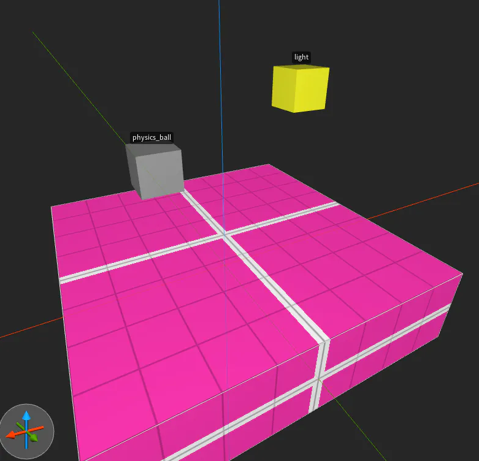
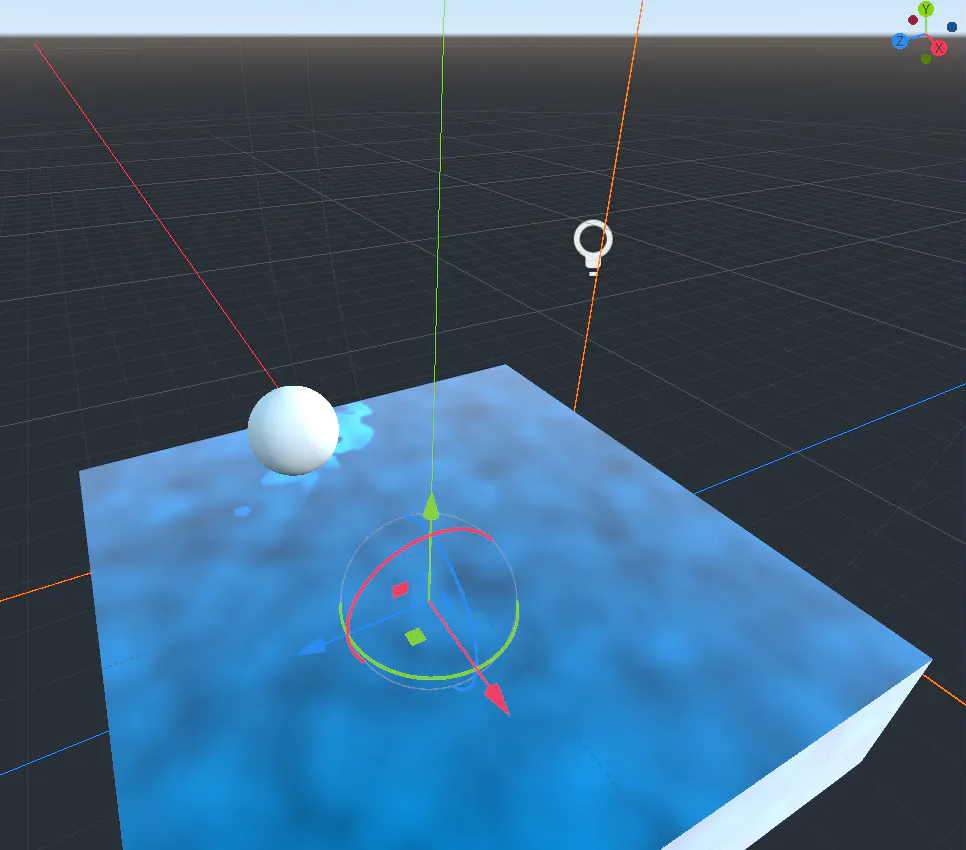

This website is currently under heavy development. Not all information is up to date or accurate, please help me out by testing what's written. [Submit an issue for this repo's Github page](https://github.com/DeerTears/DeerTears.github.io/issues) or ping Ember on the Qodot discord if you see anything that needs fixing.

# Welcome!

This is the (almost!) official documentation for [Qodot](https://github.com/shfty/qodot-plugin), a Quake-to-Godot plugin created by Shifty.

Qodot is a powerful and complex tool to convert Quake maps into Godot geometry, collisions, and scenes. Using modern Quake mapping tools like [Trenchbroom](https://trenchbroom.github.io/), you can leverage Qodot as a level design tool for Godot.

When configured in full, you can do all of your Godot game's level design, scene placement, and property-tweaking in Trenchbroom, using Godot to build the contents of the map. You can turn a Trenchbroom map like this:

Into a Godot scene like this:

You can visit the [Installation](/pages/installation.html) page if you haven't installed the plugin yet.

The [Beginner's Guide to Qodot](/pages/beginner's-guide-to-qodot.html) has everything you need to get started with Qodot on a basic level.

# How to read this guide
_Anything In Italics_ is an editor property you can change in the Inspector.

Examples:
-   _Texture_
-   _Material_
-   _Scale_
-   _Fgd Files_

Anything → With → Arrows describes nested, foldable properties or buttons, in either Trenchbroom or Godot.

Examples:
-   File → Save
-   Transform → Position → X
-   Project → Project Settings → Plugins

If you see a “🚧” emoji means I’m still doing research to work out the details. You are free to contribute knowledge on the [docs Github page](https://github.com/DeerTears/DeerTears.github.io) to assist me with this section.

**Note:** This is just anything I think could be an issue if left un-noticed, especially for users looking for deeper answers and explanations on systems.

**Warning:** This is here to note any situation where you could lose a lot of progress or time if you move forward without heeding these words. This usually indicates pitfalls and quirks that limit the flexibility of Qodot.

# Who made this?

So hi, I'm Ember. I really like sharing knowledge with people, and I created this out of my desire to see something more comprehensive for teaching how the plugin works. I've spent countless hours doing research, answering user questions, and recording steps as I've put this together. This has been my largest open-source documentation project yet. I really appreciate everyone who's come to give input, feedback, and generally just use what I've written.

Currently I've written most of what's here. You can check who else has helped put this website together here by checking [the Contributors list.](https://github.com/DeerTears/deertears.github.io/graphs/contributors)

You can check out more of what I do on [Ember's personal Github page.](https://github.com/deertears)

I want to sincerely thank [Shifty](https://github.com/shfty/) for letting me take over the documentation and rebuild it from the ground up, as well as for making such a cool plugin that's enabled so many developers. We really couldn't have all been here to do this without him.

An additional thanks to:
- MissLavender
- kiwwi
- elvisish

Thanks to everyone who's asked questions on the Qodot discord, I really enjoy responding and you all have played a part in building a better documentation!