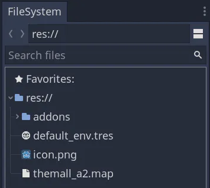
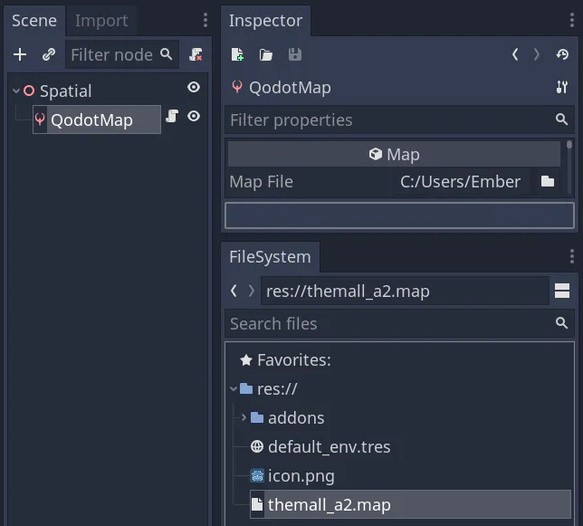
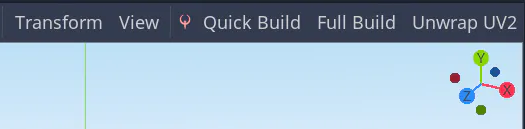
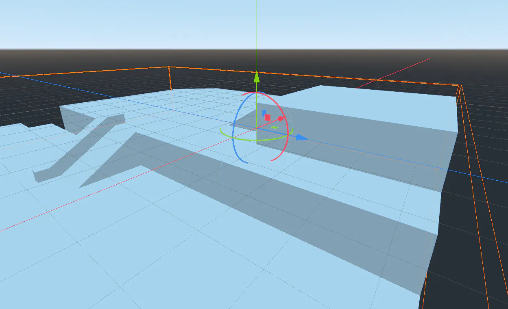
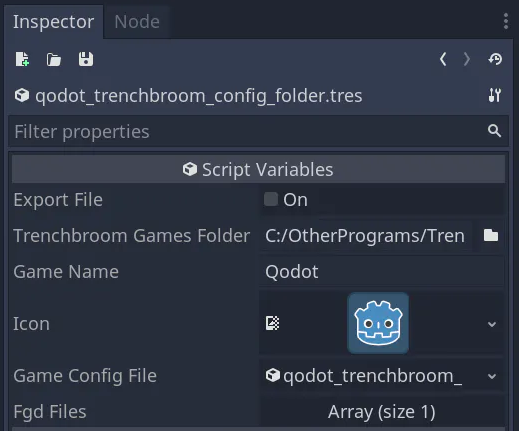
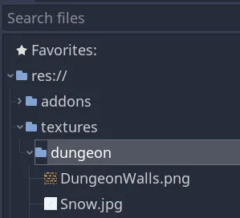
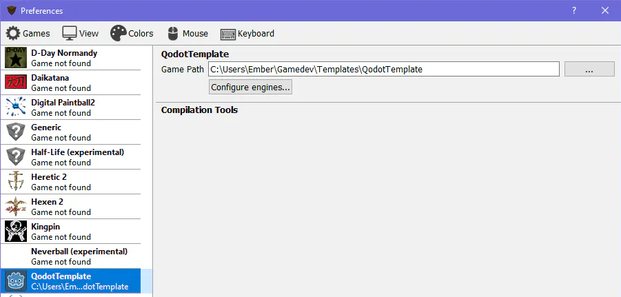
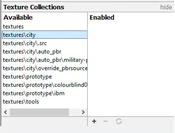
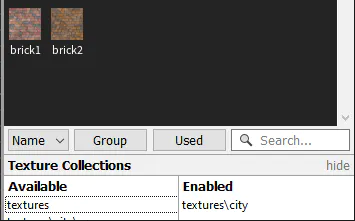

1. TOC
{:toc}

# Prerequisites
Before continuing, you should roughly know how to use:
- [Trenchbroom](https://trenchbroom.github.io/)
- [Godot Engine](https://godotengine.org/)

You can find resources to learn trenchbroom through the [Beginner's Guide to Trenchbroom](https://coda.io/d/Trenchbroom-Guide_d77T7fADkTg/Beginners-Guide-to-Trenchbroom_suqnS).

There are too many Godot learning resources to list in full, some popular ones include:

YouTube channels like:
- [GDQuest](https://www.youtube.com/c/Gdquest)
- [Garbaj](https://www.youtube.com/c/Garbaj) 
- [KidsCanCode](https://www.youtube.com/c/KidscancodeOrg)
- [Miziziziz](https://www.youtube.com/watch?v=LbyyjmOji0M&list=PLmugv6_kd0qNyt0WHVnac1f5IFzG-7grN)

Free text resources like:
- [Godot Stable Docs](https://docs.godotengine.org/en/3.4/)
- [KidsCanCode's website](http://kidscancode.org/godot_recipes/)

Videos presented as a free course:
- GDQuest: [Getting Started with Godot in 2021](https://www.gdquest.com/tutorial/godot/learning-paths/getting-started-in-2021/chapter/1.getting-started/)
- godottutorials.com: [Beginner's Guide to Godot](https://godottutorials.com/courses/godot-basics-series/) (10h) and [Introduction to GDScript](https://godottutorials.com/courses/introduction-to-gdscript/) (5h)
- Zenva: [Learn the Godot Game Engine in 50 Minutes](https://www.youtube.com/watch?v=QftpPI5iYrY) (51m)
- Tutemic: [Godot 3D: Code Architecture Course](https://www.youtube.com/watch?v=yRHN_WEulLc) (7h29m)

# Building a Map
Assuming your map is original, and has no textures or entities, this is the fastest way to get maps into Godot.

- Add a .map file to your project.



- Load it up from a QodotMap node.



- Hit Full Build.



Your map is now in Godot!



**Note:** If you don’t see QodotMap in your nodes list, make sure you have enabled Qodot in the Project → Project Settings → Plugin window.

If you want to display textures on your map geometry, you'll need to connect your Godot project to Trenchbroom with a .cfg, as shown in the [Connecting your project to Trenchbroom](#connecting-your-project-to-trenchbroom) section.

If you don't have an original map, and you're trying to port a map instead, read the page on [Porting](porting.html).

# Connecting your project to Trenchbroom
When working with an original project, there are three main steps to connecting your project to Trenchbroom:
1.  Create a Trenchbroom game config (using Qodot’s `config_folder.tres` tool)
2.  Add your Godot project directory to Trenchbroom's game path
3.  Enable texture collections to place your project's textures on brushes

**Warning:** Never add new files to the `/addons/qodot` folder. Anything you add here will be erased since Qodot can auto-update through AssetLib. You are free to use or remove files in `/addons/qodot` as we'll be seeing soon. Keep any new files to your own project structure.

If you're porting a map with an existing game config, and you're rolling your own textures into the map, you can skip ahead to [Setting Game Path in Trenchbroom](#Setting-Game-Path-in-Trenchbroom). Otherwise, you can read about [using .wad files](https://github.com/Shfty/qodot-plugin/wiki/3.-Textures-and-Materials#wad-file-support) on the old Qodot Wiki.

## Creaing a Trenchbroom game config in Qodot

A Trenchbroom game configuration (stored as a .cfg file) tells Trenchbroom the name and icon for your game, how your maps are saved, where your `/textures` folder is, and where the entity definitions are kept.

When you install Qodot, you get a resource tool to create your own .cfg file. It's here so you can create a unique .cfg for your unique Godot project.

Look for the `Qodot_Trenchbroom_Config_Folder.tres` file in your addons folder. It is installed at  `res://addons/qodot/game_definitions/trenchbroom/`. You can ignore `Qodot_Trenchbroom_Config_File.tres`, it's the Folder variant we want.

**Note:** Your project needs an `icon.png` file, or else Qodot won't be able to generate a Trenchbroom game config. Godot will complain on this step until you re-add `res://icon.png` and restart Godot.

Open the resource by double clicking on it in the Filesystem dock. This will give you a list of tools to edit the .cfg inside of your Inspector.



Inside of _Trenchbroom Games Folder_, add the directory path to the `/games` folder inside your Trenchbroom installation. Depending on your OS this is located in different folders:

| Platform | Location |
| -------- | ---------|
| Windows | The directory where the TrenchBroom executable is located, such as C:\Users\<username>\Documents\Trenchbroom\games\ |
| macOS | TrenchBroom.app/Contents/Resources |
| Linux | <prefix>/share/trenchbroom, where <prefix> is the installation prefix. |

If you don't have write access to the folder, you can also use the UserData folder for your OS:

| Platform | Location |
| -------- | ---------|
| Windows | C:\Users\<username>\AppData\Roaming\TrenchBroom|
| macOS | ~/Library/Application Support/TrenchBroom |
| Linux | ~/.TrenchBroom |

Back to editing the .cfg, you should change the _Game Name_ to your project’s name to avoid overwriting other Godot project names in the future.

Before clicking _Export File_ make sure you have a `res://textures/tutorial/` folder in your Godot project directory. This will help us later when we add textures to our project. You can call the folder something else, there just needs to be a subfolder under the `/textures` folder for Trenchbroom to read textures later. This isn't a best practice for large projects (more on that later) but it's easiest when getting started.



Finally, click the _Export File_ checkbox at the top. Your game config should now be in Trenchbroom! You can go and see if Trenchbroom has your game listed in the games list when creating a new map.

The next two steps will ensure Trenchbroom can read your project's textures, and so Qodot can correctly read those textures and apply it to geometry in Godot.

## Setting Game Path in Trenchbroom
Once you've got a config file, Trenchbroom still needs you to manually set the *Game Path* property in its Preferences menu. Once set, Trenchbroom will be able to read your Godot project’s `/textures` folder.

Launch Trenchbroom, click "New Map..." and select your game's name and icon from the Select Game list.


Once it's selected, click "Open preferences..." and find your game in the preferences list. In this example, I called my game QodotTemplate. Yours will be different depending on the _Game Name_ you set earlier in `Qodot_Trenchbroom_Config_Folder.tres`.



Under "Game Path", click the ellipsis "..." and select your Godot project folder from your file system. Click Apply.

You can now create a New Map with your Godot project name as the game type.

**Note:** If you're having trouble clicking the apply button on the window, temporarily increase your screen's resolution. Not clicking apply here can cause issues later on when reloading Trenchbroom.

## Enabling Texture Collections in Trenchbroom
You can only enable a texture collection if your project has the following conditions:
- Your game path is set
- There's a top-level folder inside your game path called `/textures`
- There's a subfolder inside of `/textures`, such as `/tutorial` or `/forest`
- There's a .png or .jpg image file inside of the subfolder

Once all of these conditions are satisfied, press F5 to refresh the texture definitions in Trenchbroom.

Navigate to the "Face" tab in the top right, and unfold the "Texture Collections" menu at the bottom.

Click the name of a folder you want to enable.



Click "+" at the bottom-right to enable it, moving it to the "enabled" collection.



# The Next Step

Congratulations! You've completed the Beginner's Guide to Qodot. From having completed this guide, you should be able to build maps in Qodot and unify textures between Trenchbroom and your Godot project.

If you're interested in learning how to apply PBR materials and shaders to brushes, read [Textures](textures.html) for more info.

If you want to place Godot scenes and configure their properties using Trenchbroom, read [Entities](entities.html) for more info.

If you want a breakdown of Qodot's many systems, and prepare your project for scaling up, read [Best Practices](best-practices.html).

What follows below is a final few points that don't fit into these other categories, but are still important to know.

# Clipping

QodotMap lets you choose one texture to act as your "clip" texture.

In the Clip Texture property, add the subfolder and image name for your clip texture without the file extension.

For example, if I have this folder structure:

```
res://
	/textures
		/special
			clip.png
```

I can make clip.png my clip texture by adding `/special/clip` into the Clip Texture field of a QodotMap.