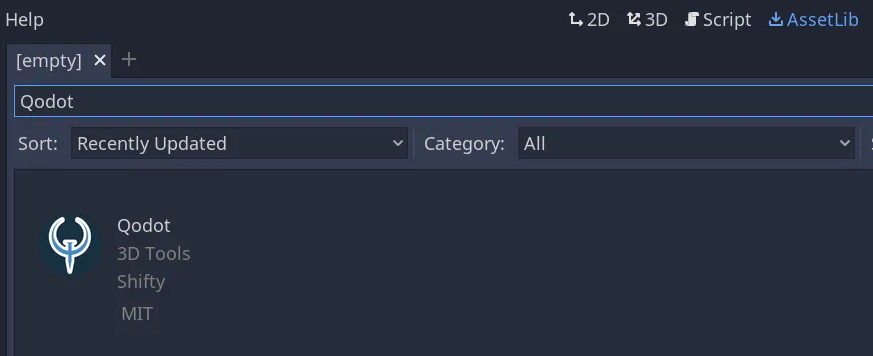
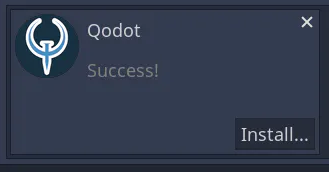
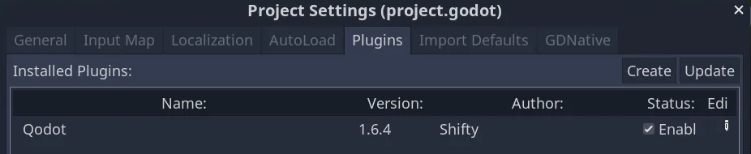

# Installation

## Prerequisites
You should know how to use
- [Trenchbroom](https://trenchbroom.github.io/)
- [Godot Engine](https://godotengine.org/)

You can find resources to learn trenchbroom through the [Beginner's Guide to Trenchbroom](https://coda.io/d/Trenchbroom-Guide_d77T7fADkTg/Beginners-Guide-to-Trenchbroom_suqnS).

GDQuest’s [Getting Started with Godot in 2021](https://www.gdquest.com/tutorial/godot/learning-paths/getting-started-in-2021/chapter/1.getting-started/) series is great to help you get started with Godot Engine.

## Installing Qodot
Create a new Godot project.

Once you're loaded into the project, go to the AssetLib tab and search for “Qodot”.

Once you click “Qodot” and click download, wait for it to finish downloading, then click "Install":

A tree of items to be installed will show up. Click "Install" at the bottom of the window.

**Note:** Godot 3.x can hang during the import process, but this is not a crash. It will finish importing if you wait long enough. If this is taking too long, and you're not interested in seeing the example scenes, delete the `/addons/qodot/` folder, install the plugin again, and uncheck the `/addons/qodot/textures` folder to prevent this import hang.

When it's done, go to Project → Project Settings -> Plugins. By default, Qodot is not enabled. Click the checkbox next to its name to enable it:

You’re ready to proceed with the rest of the guide!