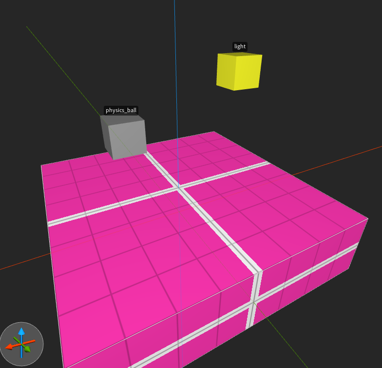
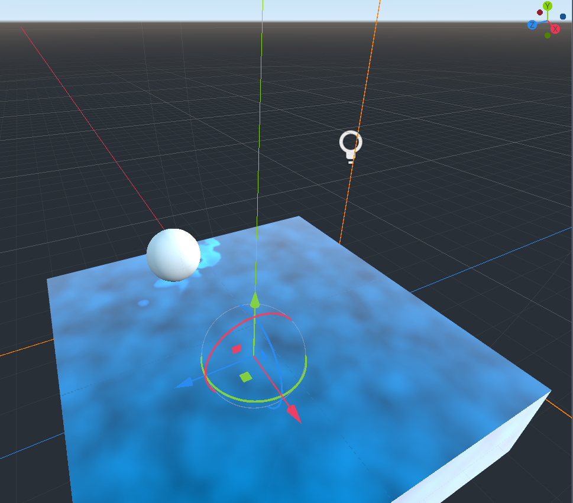

# Intro

## Notice

This guide is a work in progress and needs testing. Please submit fixes to anything as a PRs, or ping Ember on the Qodot discord if you notice something is incorrect. I'm happy to see wording or smaller details improved and made more explicit.

## How to read these docs

This doc assumes you know how to use Trenchbroom to create .map files with brushes and textures. It assumes you know how to use Godot to work with nodes, scenes, materials, and resources.

Anything In Italics is an editor property you can change in the Inspector.

Examples:
- *Texture*
- *Material*
- *Scale*
- *Fgd Files*

Anything -> With -> Arrows describes nested, foldable properties or buttons in either Trenchbroom or Godot.

Examples:
- File -> Save
- SpatialMaterial -> Vertex -> Is sRGB
- Project -> Project Settings -> Plugins

It helps if you know how to work with and save new resources in Godot.

## Goal

Trenchbroom can be used to place textures, entities, and brush entities, while Qodot can transform those into Godot scenes and materials. It’s super configurable, so you can turn something like this:

Into this:

From reading these docs you will
Anyways, let’s make some cool stuff using old technology in a modern game engine.

[Next page.](01-installation.md)
