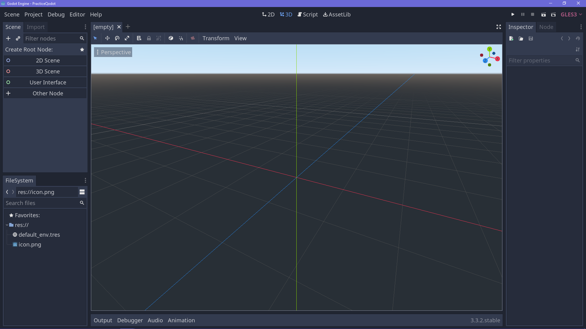
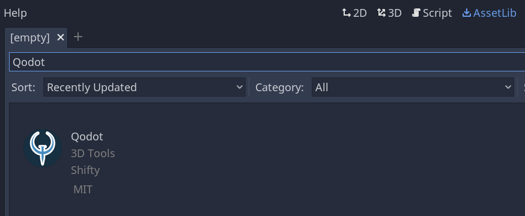
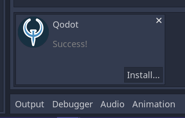
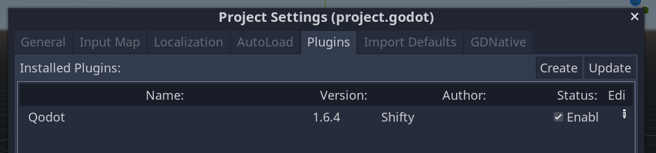

Create a new Godot project.

Go to AssetLib in the top left and search for “Qodot”.

Once you click “Qodot” and click download, wait for it to finish downloading, then click install.

A tree of items to be installed will show up. Click the install button at the bottom of the window.

Note: If Godot keeps crashing on re-importing, try clearing your /addons folder from outside the engine. Restart the process, but uncheck textures  when you see the tree of items that will be installed. I will be explaining how to use textures with Qodot, so you don’t actually need /addons/qodot/textures for this guide.

Once it’s done, go to Project → Project Settings at the top. Click on the “Plugins” tab. By default, Qodot is not enabled. Click the checkbox to enable it.

You’re ready to proceed with the rest of the guide!

[Next page.](02-building-a-map.md)
