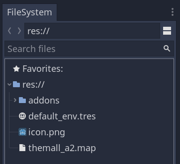
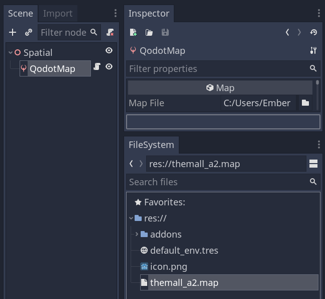
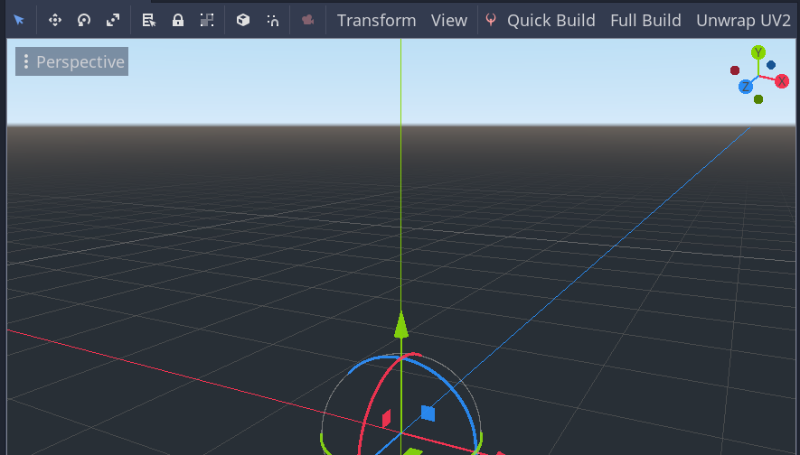
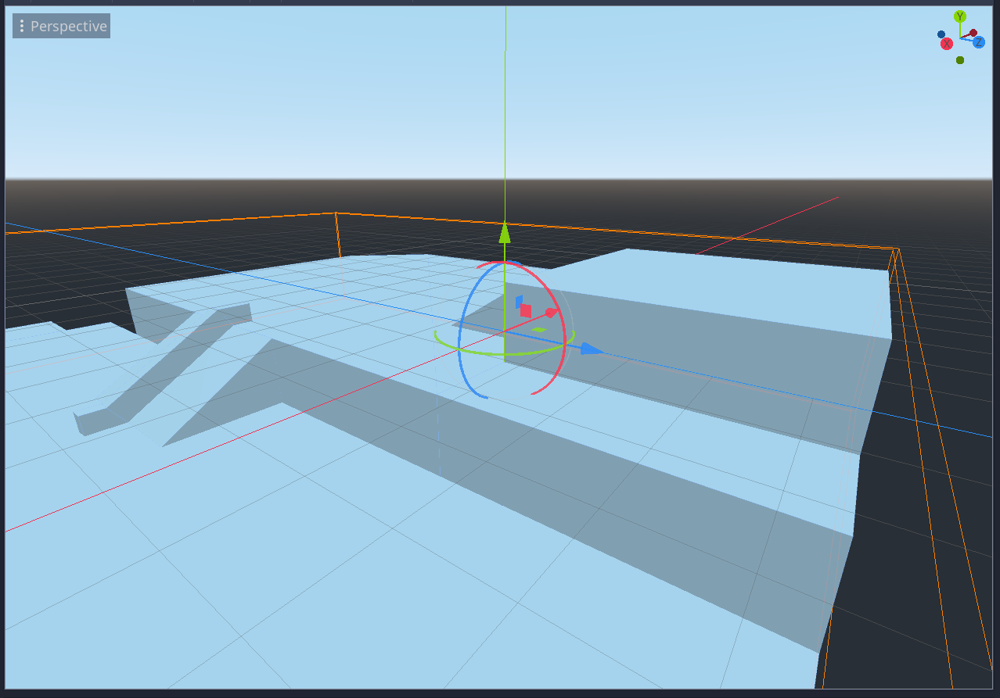

# Building a Map

Assuming you want to get right to building geometry, here’s how:

1. Add a .map file to your project.

2. Load it up from a QodotMap node.

3. Hit Full Build.

Your map is now in Godot!

Note: If you don’t see QodotMap in your nodes list, make sure you have enabled Qodot in the Project → Project Settings → Plugin window. If nothing happens, restart Godot and try again.

[Back to the first page.](00-intro.md)
